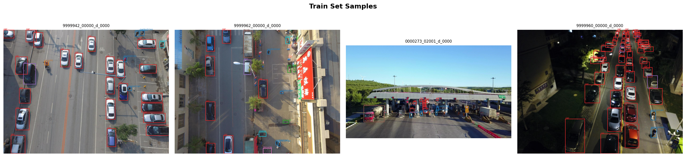
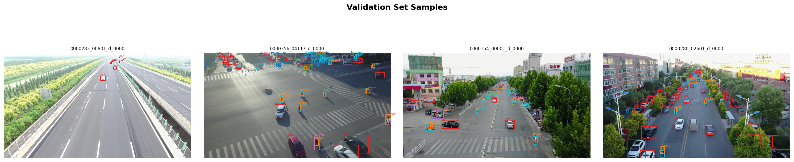
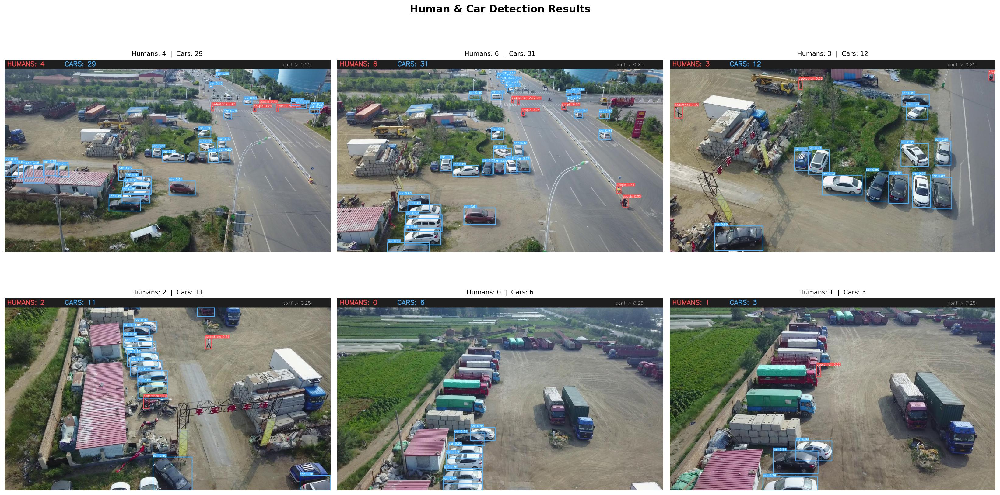
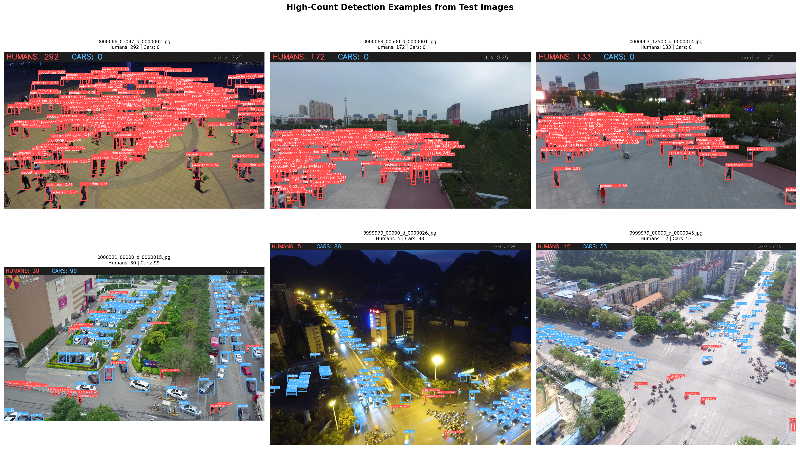
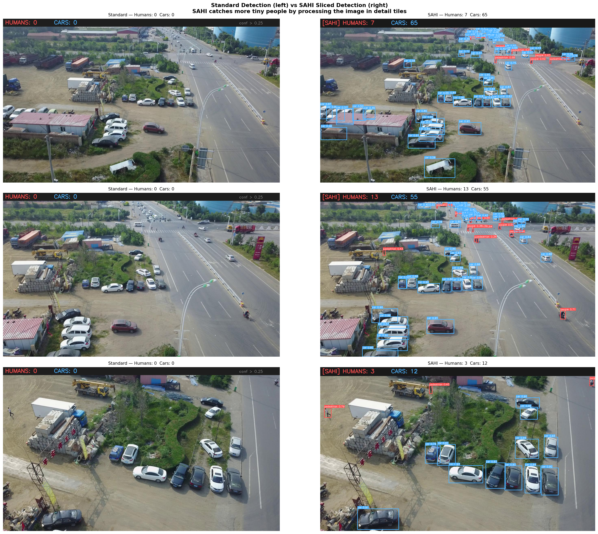

# Drone Human & Car Detection System
### Antlings Internship Programme — AI/ML Technical Assessment

---

## Overview

This project delivers a complete computer vision pipeline for analysing drone aerial imagery. The system detects humans and cars in each frame, counts the total number of humans, and visualises results with annotated bounding boxes. As a bonus task, object tracking with persistent identity assignment across video frames is implemented using ByteTrack.

The entire pipeline was built and executed on Kaggle using a free NVIDIA T4 GPU. No local hardware is required to reproduce results.

**AI tools used during development:** Claude (Anthropic) and Codex were used for code generation, debugging, and architectural guidance, as explicitly permitted by the assessment guidelines. All implementation decisions and results are understood and can be explained in full.

---

## Demo Video

> (https://drive.google.com/drive/folders/1SXTiVAibBvJsRvcNcytdS3zlhQBASyqS?usp=drive_link)

---

## Repository Structure

```
drone-human-detection/
├── models/
│   ├── yolov8s.pt                          ← Base pretrained model (COCO weights)
│   └── yolo26n.pt                          ← Downloaded automatically by Ultralytics
├── notebooks/
│   ├── visdrone-yolo-detection.ipynb       ← Full executable Kaggle notebook
│   └── PDF_version/
│       └── visdrone-yolo-detection.pdf     ← Static PDF export of the notebook
├── outputs/
│   ├── Train_Set_Samples.png               ← Task 1: training set visualisation
│   ├── Validation_Set_Samples.png          ← Task 1: validation set visualisation
│   ├── detection_results.png               ← Task 3: annotated detection output
│   ├── high_count_detection_examples.png   ← Task 3: extreme-count examples
│   ├── sahi_comparison.png                 ← Task 5: standard vs SAHI comparison
│   ├── detection_log.csv                   ← Per-image human/car counts (1,610 rows)
│   ├── confidence_threshold_analysis.csv   ← Confidence threshold sweep results
│   ├── confidence_threshold_analysis.png   ← Confidence threshold analysis plot
│   └── visdrone.yaml                       ← Dataset configuration file
└── runs_(training_files)/
    ├── best_weight/
    │   └── best.pt                         ← Best model checkpoint (use for inference)
    ├── last_weight/
    │   └── last.pt                         ← Final epoch checkpoint
    └── visdrone_train/
        ├── results.csv                     ← Per-epoch training metrics
        ├── results.png                     ← Training curves plot
        ├── confusion_matrix.png
        ├── confusion_matrix_normalized.png
        ├── BoxP_curve.png
        ├── BoxR_curve.png
        ├── BoxF1_curve.png
        ├── BoxPR_curve.png
        ├── train_batch0.jpg                ← Sample augmented training batches
        ├── val_batch0_labels.jpg           ← Ground truth on validation batch
        └── val_batch0_pred.jpg             ← Model predictions on validation batch
```

---

## Task 1 — Dataset Understanding & Preprocessing

### Dataset Structure

The dataset is **VisDrone2019-DET**, a benchmark aerial detection dataset collected by the AISKYEYE team across 14 cities in China, covering urban roads, pedestrian zones, markets, and highways captured from varying drone altitudes.

| Split | Images | Labels | Used For |
|---|---|---|---|
| Train | 6,471 | ✅ | Model learning |
| Validation | 548 | ✅ | Per-epoch performance check |
| Test-Dev | 1,610 | ✅ | Final evaluation and counting |
| Test-Challenge | ~1,580 | ❌ | Original competition submission only |

Labels are provided in **YOLO format** — each `.txt` annotation file contains one line per object, structured as five space-separated values: class ID followed by normalised x-centre, y-centre, width, and height (all between 0 and 1). This meant no label conversion was necessary; the dataset was training-ready as-is. Cell 1 programmatically verified this structure, confirming 6,471 / 548 / 1,610 perfectly matched image-label pairs across the three labelled splits with zero mismatches.

The dataset defines **10 object classes**, of which this pipeline targets four:

| ID | Class | Role in Pipeline |
|---|---|---|
| 0 | pedestrian | Counted as Human ✅ |
| 1 | people | Counted as Human ✅ |
| 2 | bicycle | Detected internally, filtered at output |
| 3 | car | Counted as Car ✅ |
| 4 | van | Counted as Car ✅ |
| 5–9 | truck, tricycle, awning-tricycle, bus, motor | Detected internally, filtered at output |

The model is trained on all 10 classes to develop richer visual feature representations, and the 4-class selection is applied as a filter at inference time. Van is grouped with car because the visual distinction between the two is negligible at drone altitude.

### Sample Visualisations





### Challenges Noticed in the Dataset

The primary challenge is **extreme object miniaturisation**. At drone altitude, a standing adult may occupy as few as 8–15 pixels in a 1920×1080 frame. Standard YOLO inference further compresses these objects, and they frequently fall below the detection threshold entirely. This directly motivated the SAHI sliced inference approach described in Task 3.

A secondary challenge is **class imbalance** — cars appear in 515 of 548 validation images while awning-tricycles appear in only 220, creating uneven training signal. The practical impact is limited since the target classes (pedestrian, people, car, van) are among the most frequently represented.

---

## Task 2 — Model Training

### Approach

A **YOLOv8s** model pre-trained on the COCO dataset was fine-tuned on VisDrone training data. This transfer learning approach retains visual feature knowledge from COCO and adapts the final classification layer to the 10 VisDrone-specific classes. The key line is `YOLO('yolov8s.pt')` — Ultralytics automatically replaces the 80-class COCO output head with a fresh 10-class head, confirmed in the training log: `Overriding model.yaml nc=80 with nc=10`.

### Training Configuration

| Parameter | Value | Rationale |
|---|---|---|
| Base model | yolov8s.pt | Balanced speed and accuracy |
| Epochs | 50 | Sufficient for convergence |
| Image size | 800px | Larger than default 640px to preserve small objects |
| Batch size | 16 | Fills T4 GPU memory efficiently |
| Optimizer | AdamW (auto-selected) | lr=0.000714, momentum=0.9 |
| Platform | Kaggle T4 GPU (15GB VRAM) | Free cloud GPU |
| Total training time | 2.819 hours | — |

### Augmentation

Mosaic augmentation (`mosaic=1.0`) was the most impactful setting — it combines four training images into one sample, substantially increasing the number of small objects the model sees per training step. Mosaic was disabled for the final 10 epochs (`close_mosaic=10`) to allow cleaner final convergence. Horizontal flip (`fliplr=0.5`) is applied since left/right orientation is meaningless in aerial footage. Vertical flip was explicitly disabled (`flipud=0.0`) because drone cameras always point downward and a vertically flipped aerial image is physically unrealistic.

### Training Results

/visdrone_train/results.png)

| Metric | Value | Epoch |
|---|---|---|
| Best mAP@50 | **0.4380** | 50 |
| Best mAP@50-95 | **0.2584** | 46 |

The mAP curve shows steady improvement through all 50 epochs with no sign of overfitting, indicating further training would likely yield additional gains.

### Sample Predictions on Validation Set

/visdrone_train/val_batch0_pred.jpg)

---

## Task 3 — Human & Car Detection with Human Counting

### Detection Pipeline

```
Input Image
    ↓
YOLOv8s Inference — all 10 classes
    ↓
Filter: classes {0, 1} → Human  |  classes {3, 4} → Car
    ↓
Draw bounding boxes + confidence labels
    ↓
Add count banner: HUMANS: N  |  CARS: N
    ↓
Output Annotated Image
```

Humans are rendered with **red** bounding boxes and cars with **blue** boxes. A dark banner at the top of each annotated image displays the live per-image count.

### Results Across the Full Test-Dev Set (1,610 Images)

| Metric | Value |
|---|---|
| Total humans detected | **13,582** |
| Total cars detected | **32,036** |
| Average humans per image | 8.44 |
| Average cars per image | 19.90 |
| Images with no humans | 585 |
| Images with no cars | 82 |
| Processing time | ~55 seconds |

The top-ranked image by human count returned 300 detections in a single frame, consistent with dense crowd scenes captured at low altitude.

### Detection Visualisation





### SAHI Sliced Inference

Standard inference shrinks the full image to 800px before processing, reducing already-tiny humans to fewer than 5 pixels — often below the detection threshold. **SAHI (Sliced Aided Hyper Inference)** resolves this by dividing the original full-resolution image into overlapping 800×800 pixel tiles, running inference on each tile at full detail, then merging all bounding boxes back into the original image coordinate space. A 20% overlap between adjacent tiles prevents objects at tile boundaries from being split across tiles and missed.



The left column shows standard inference and the right shows SAHI. The improvement in small-human recall is clearly visible in crowded scenes, with no retraining of the model required.

---

## Task 4 — Object Tracking (Bonus)

### Why Tracking Improves Counting

Per-frame detection counts every visible object in every frame independently. A person appearing across 100 consecutive frames would be counted 100 times. **ByteTrack** assigns a persistent integer ID to each detected object and maintains that ID as the object moves through the scene, enabling the system to count unique individuals rather than per-frame occurrences.

### Implementation

ByteTrack is built directly into the Ultralytics library and requires no additional installation. It is invoked by replacing `model(...)` with `model.track(..., tracker='bytetrack.yaml', persist=True)`.

Since the VisDrone DET dataset consists of individual images rather than video files, Cell 9 reconstructs a video from raw frames by reading the sequence IDs and frame numbers encoded in the filenames (for example, `9999955_00001_d_0000001.jpg`). Sequences were scored on length, frame gap consistency, and visual smoothness between consecutive frames. Sequence `9999955` was selected, providing 434 available frames of which 150 were used to produce a 15-second video at 10fps.

Each bounding box in the tracked output displays the object type (HUMAN or CAR), its persistent track ID, the class name, and confidence score. The banner at the top of each frame shows the current-frame detection count.

---

## Task 5 — Evaluation & Visualisation

### Quantitative Results

Formal evaluation was run against the full validation set (548 images, 38,759 annotated instances) using `model.val()` at 800px resolution.

| Metric | Value |
|---|---|
| **mAP@50** | **0.4374** |
| **mAP@50-95** | **0.2598** |
| **Precision** | **0.5562** |
| **Recall** | **0.4407** |

**Per-class mAP@50-95:**

| Class | mAP@50-95 |
|---|---|
| car | 0.5722 |
| bus | 0.4340 |
| van | 0.3352 |
| truck | 0.2789 |
| pedestrian | 0.2292 |
| motor | 0.2272 |
| tricycle | 0.1860 |
| people | 0.1473 |
| bicycle | 0.0872 |
| awning-tricycle | 0.1010 |

Cars achieve the strongest individual mAP at 0.572 due to their larger pixel footprint and distinctive shape from above. Pedestrians and people score lower, reflecting the small-object challenge inherent to this dataset. State-of-the-art specialised models on VisDrone typically achieve mAP@50 in the range of 0.45–0.55 with significantly more compute. Achieving 0.437 with a small generalised model in under three hours of GPU time is competitive for these constraints.

### Evaluation Plots

/visdrone_train/confusion_matrix_normalized.png)

/visdrone_train/BoxPR_curve.png)

### Strengths

The pipeline is fully end-to-end, covering dataset verification, training, inference, counting, and tracking in a single reproducible notebook. SAHI meaningfully improves small-object recall without any retraining. The system processes 1,610 test images in approximately 55 seconds on a T4 GPU. ByteTrack provides identity-consistent counting in video scenarios, which is more meaningful than naive per-frame summation.

### Limitations

A recall of 0.44 indicates that roughly 56% of ground-truth objects are missed, primarily small or partially occluded humans. Precision of 0.56 reflects a moderate false positive rate in cluttered environments. A larger model (YOLOv8m or YOLOv8l), higher input resolution (1280px), or extended training would likely yield measurable improvements. Counting in dense crowd scenes using the `people` class is inherently approximate — a single annotation may represent 5–20 individuals.

### Challenges Faced

The initial GPU assignment on Kaggle was a Tesla P100 (CUDA capability sm_60), which is incompatible with the installed PyTorch version requiring sm_70 or higher (`AcceleratorError: CUDA error: no kernel image is available for execution on the device`). Switching the accelerator to a T4 (sm_75) resolved this without any code changes.

A non-obvious variable naming conflict between the detection cell and the SAHI cell caused all batch detection counts to return zero. Both cells defined `HUMAN_CLASSES` and `CAR_CLASSES`, but used different Python types — integer dictionaries in the detection cell and string sets in the SAHI cell. Since Kaggle notebooks share memory across cells, the string versions silently overwrote the integer versions. The check `if integer in {string, string}` always evaluates as false, producing zero counts across all 1,610 images. The fix required a small reset cell restoring the correct integer dictionary types before the batch loop.

---

## How to Run

### Requirements

```bash
pip install ultralytics sahi
```

### Inference on a Single Image

```python
from ultralytics import YOLO

model = YOLO('runs_(training_files)/best_weight/best.pt')
results = model('your_image.jpg', conf=0.25)[0]

human_count = sum(1 for cls in results.boxes.cls if int(cls) in {0, 1})
car_count   = sum(1 for cls in results.boxes.cls if int(cls) in {3, 4})
print(f"Humans: {human_count} | Cars: {car_count}")
```

### Full Notebook

Open `notebooks/visdrone-yolo-detection.ipynb` in Kaggle and attach the [VisDrone dataset](https://www.kaggle.com/datasets/banuprasadb/visdrone-dataset). Enable the **T4 GPU** accelerator in the session settings panel on the right sidebar. Run all cells in order from top to bottom.

---

## Acknowledgements

Dataset: [VisDrone2019](https://github.com/VisDrone/VisDrone-Dataset) by the AISKYEYE Team, Tianjin University.
Model framework: [Ultralytics YOLOv8](https://github.com/ultralytics/ultralytics).
Sliced inference: [SAHI](https://github.com/obss/sahi) by OBSS.
AI tools used for code generation and debugging: [Claude](https://claude.ai) (Anthropic) and Codex.
